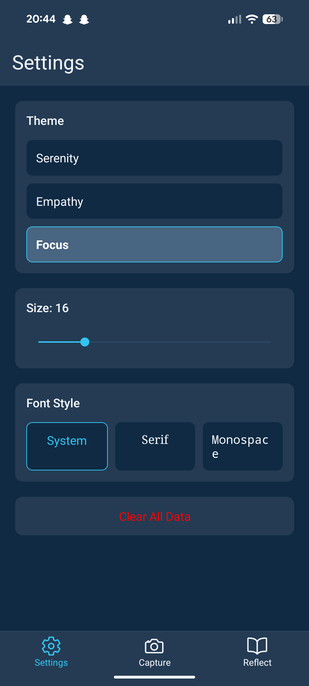
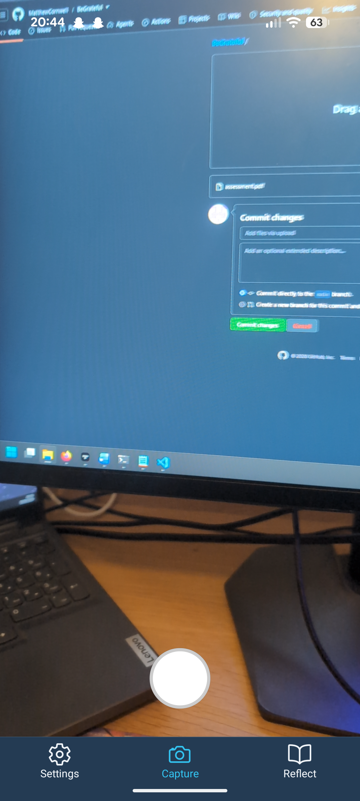
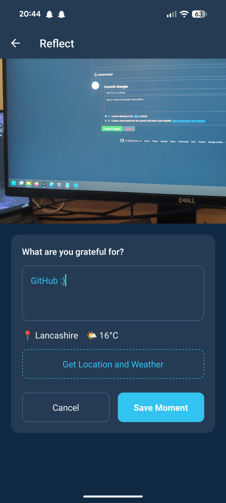

# BeGrateful Mobile App 

Final year React Native mobile application. An offline gratitude journalling app built with React Native + Expo, designed with accessibility and privacy as core requirements (The theme of the assessment was mental health)

  
  
  

**What it does**

BeGrateful lets users capture quick moments in their day to day life in the form of a photo and an optional comment / location and weather meta data, allowing them to reflect later on them in a private offline gallery. 

**Stack**

- React Native + Expo
- TypeScript
- expo-sqlite
- expo-location, expo-camera, expo-media-library

Easy to run with:

npm install

npx expo start

Then scan the QR code with Expo Go on iOS/Android

[Read the full assessment paper (PDF)](assessment.pdf)
